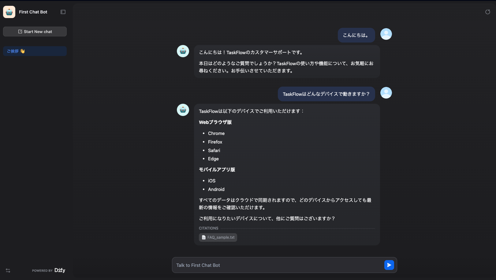
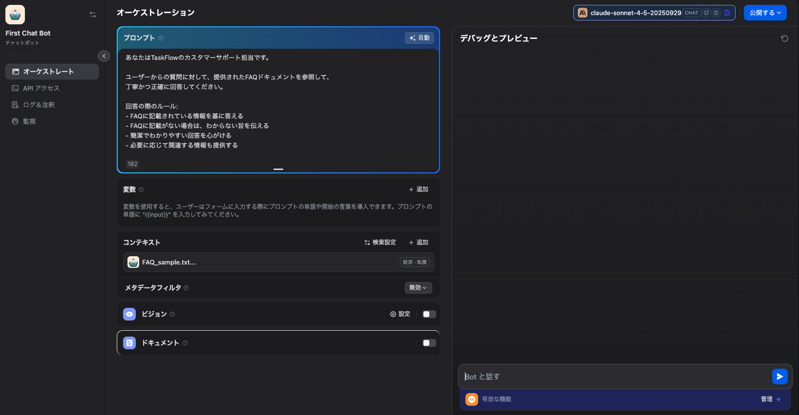

# Dify FAQ チャットボット

Dify CloudとClaude APIを使ったRAG実装のFAQチャットボットのシンプルなサンプルです。

## 概要

Difyを用いたFAQチャットボットのPoC用途サンプルとして、
短期間での技術検証や業務適用可否の確認を目的に作成しています。

架空のプロジェクト管理ツール「TaskFlow」のサポートbotとして、
FAQドキュメントから情報を検索して回答します。

## 技術スタック

- Dify Cloud
- Claude Sonnet 4.5 (Anthropic API)
- RAG (Dify標準のコンテキストを使用。ベクトル化の際のパラメータはデフォルト)

## デモ

### チャット画面


### オーケストレーション


**注**: デプロイ済み(非公開)。デモ可能です。

## セットアップ

1. `First_Chat_Bot.yml` をDifyにインポート
2. Claude APIキーを設定
3. `FAQ_sample.txt` をナレッジベースにアップロード
4. コンテキストにナレッジベースを追加
5. デプロイ

## ファイル構成
```
├── README.md
├── First_Chat_Bot.yml     # Dify設定
├── FAQ_sample.txt         # ナレッジベース
└── screenshots/
```

## 制限事項

- ナレッジ量が増えた場合の検索精度やプロンプト調整は未検証
